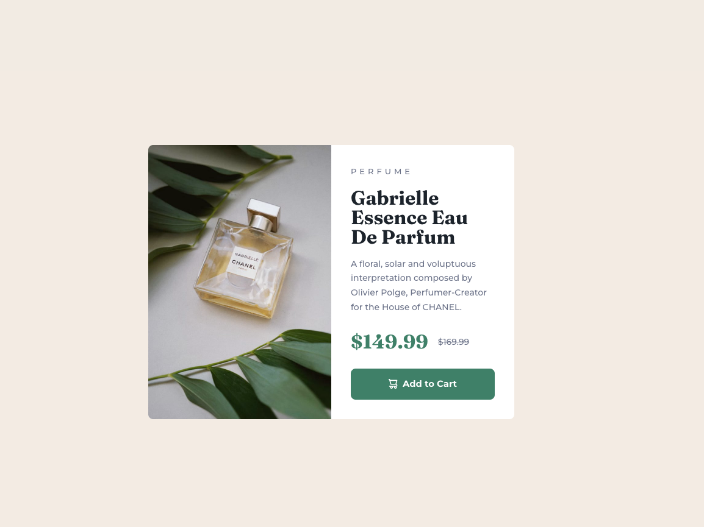
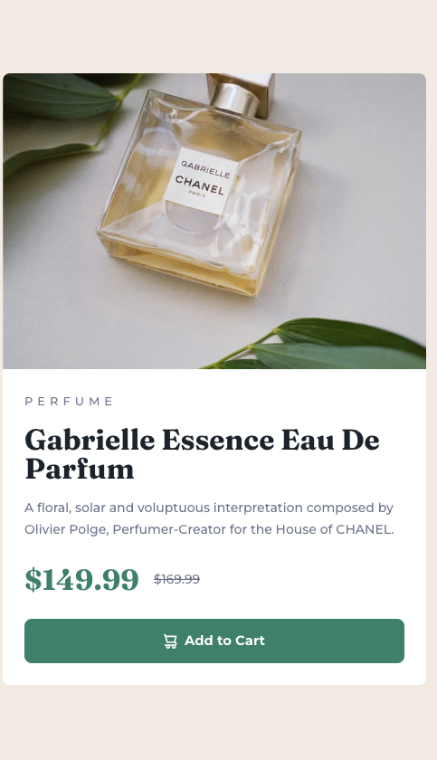

screenshot# Frontend Mentor - Product preview card component solution

This is a solution to the [Product preview card component challenge on Frontend Mentor](https://www.frontendmentor.io/challenges/product-preview-card-component-GO7UmttRfa). Frontend Mentor challenges help you improve your coding skills by building realistic projects. 

## Table of contents

- [Overview](#overview)
  - [The challenge](#the-challenge)
  - [Screenshot](#screenshot)
  - [Links](#links)
- [My process](#my-process)
  - [Built with](#built-with)
  - [What I learned](#what-i-learned)
  - [Continued development](#continued-development)
  - [Useful resources](#useful-resources)
- [Author](#author)
- [Acknowledgments](#acknowledgments)

## Overview

### The challenge

Users should be able to:

- View the optimal layout depending on their device's screen size
- See hover and focus states for interactive elements

### Screenshot




### Links

- Solution URL: [Solution Githhub Repo](https://github.com/FiyonaM/Product-preview-card)
- Live Site URL: [Github Live site](https://fiyonam.github.io/Product-preview-card/)

## My process

### Built with

- Semantic HTML5 markup
- CSS custom properties
- Flexbox
- CSS Grid


### What I learned

- Declaring global CSS variables
:root can be useful for declaring global CSS variables:

:root {
  --main-color: hotpink;
  --pane-padding: 5px 42px;
}

- var()

The var() CSS function can be used to insert the value of a custom property (sometimes called a "CSS variable") instead of any part of a value of another property.

border-color: var(--main-color);

- place-content

The place-content CSS shorthand property allows you to align content along both the block and inline directions at once (i.e. the align-content and justify-content properties) in a relevant layout system such as Grid or Flexbox.

```css
.proud-of-this-css {
  place-content: center;
}
```


### Continued development

I probably will look more into the responsive elements of css.


## Author

- Frontend Mentor - [@FiyonaM](https://www.frontendmentor.io/profile/FiyonaM)


